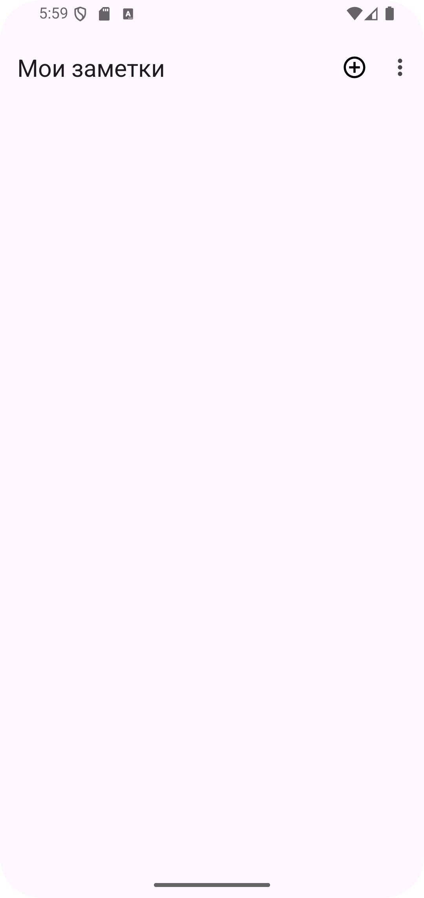
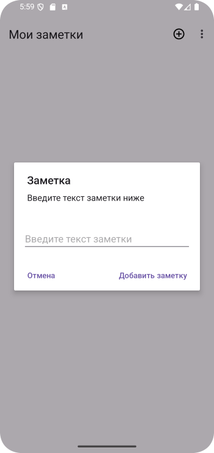
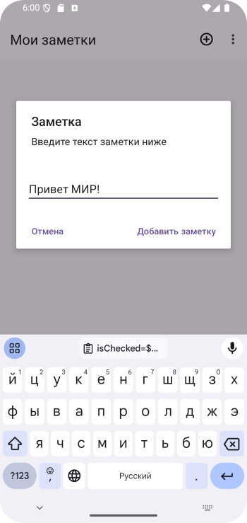
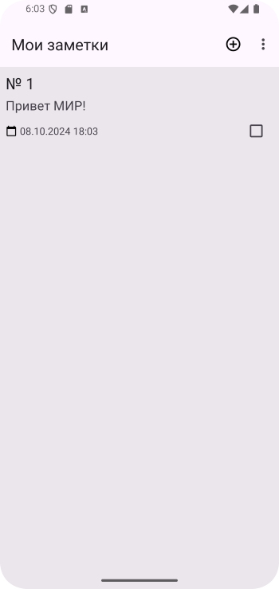
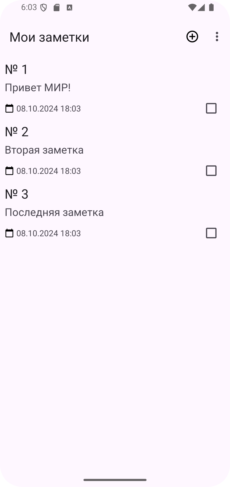
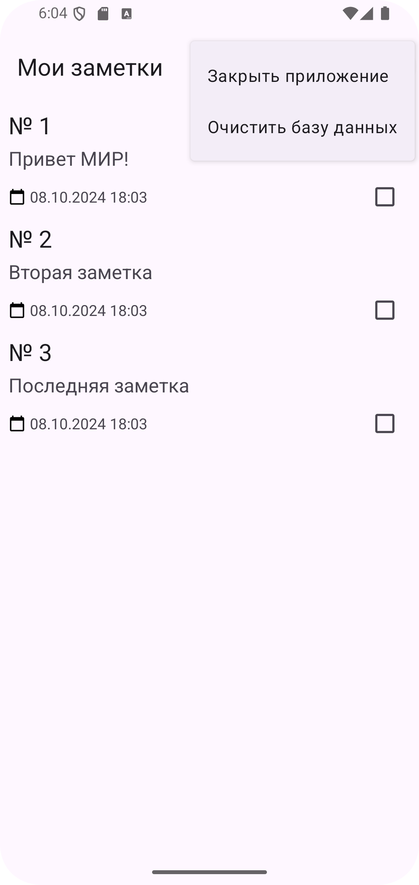
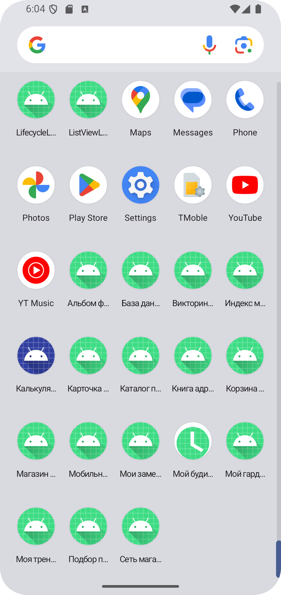
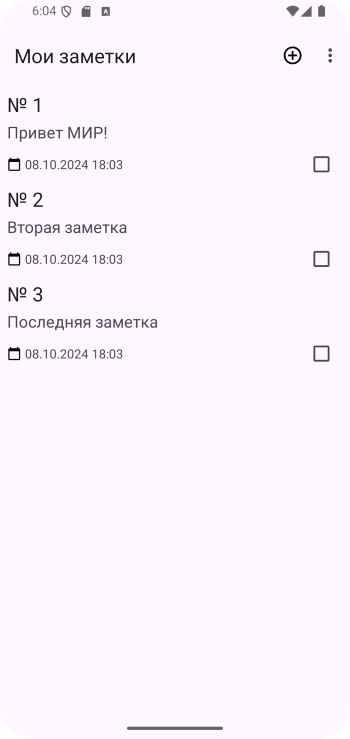

# Домашнее задание по теме "Fragments"

Создаем свой список **«Мои заметки»** на основе элемента **RecyclerView**. На экране приложения необходимо создать список, в котором ячейка списка включает порядковый номер заметки, текст заметки, с правой стороны **CheckBox** для отметки, выполненной заметки и поле времени и даты создания заметки. Для этого необходимо создать класс модели с вышеуказанными полями. Выше списка располагается поле ввода текста заметки и кнопка добавления заметки в список.

Необходимо предусмотреть создание файла элемента списка с соответствующими элементами этого списка для создания адаптера.

Всю конструкцию приложения рассмотреть на основе фрагмента.

Для работы приложения необходимо создать:

На экране:

1. Toolbar с заголовком **«Мои заметки»**.

2. Поле ввода заметки.

3. Кнопка **«Добавить»**.

4. **RecyclerView** для отображения списка заметок.

5. Пункт меню **«Exit»** для выхода из приложения.

**\*\*\* Необязательно, но желательно (усложненный уровень).**

Реализовать сохранение созданных заметок в базу данных, их получение из базы данных при запуске приложения.

Приложение необходимо сохранить проектом в удаленном репозитории, для проверки качества предоставить ссылку преподавателю, либо сделать скрины эмулятора при каждом шаге работы приложения или снять видео экрана при работе приложения.

## Скриншоты домашнего задания по теме "Fragments"

Скриншоты находятся здесь

